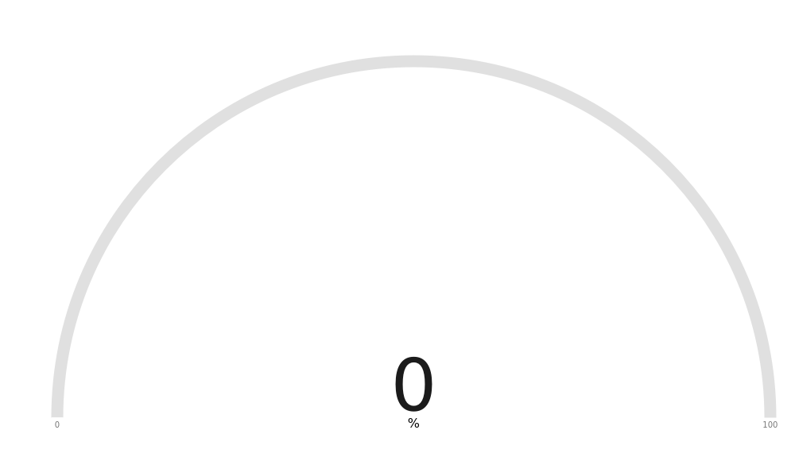
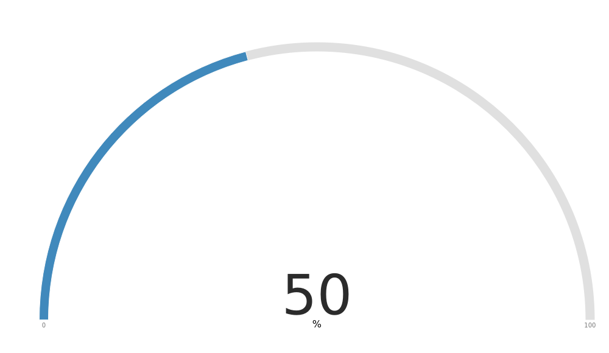
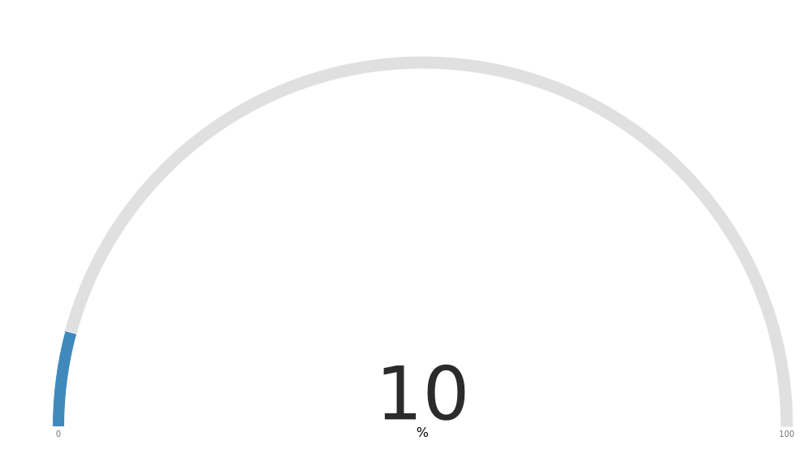

<!-- README.md is generated from README.Rmd. Please edit that file -->

[](https://lifecycle.r-lib.org/articles/stages.html#deprecated)
[](https://travis-ci.org/jumpingrivers/headR)
[](https://travis-ci.org/jumpingrivers/gaugeR)

# gaugeR

A function to create interactive gauge charts as well as output and
render functions for using gauge within Shiny applications and
interactive Rmd documents.

## Installation

You can install **gaugeR** from github with:

``` r
# install.packages("devtools")
devtools::install_github("jumpingrivers/gaugeR")
```

## Example

This are some basic examples of the command `gauge()`:

``` r
library(gaugeR)
gauge(0)
```



``` r
gauge(50)
```



``` r
gauge(1:4)
```



## Shiny Example

Here is a very basic shiny app example

``` r
## Only run this in interactive sessions
if(interactive()){
  ui <- fluidPage(
    titlePanel("Gauge Example!"),
    sidebarLayout(
      sidebarPanel(
        sliderInput("obs",
                    "Pick a percentage",
                    min = 1,
                    max = 100,
                    value = 5)
      ),
      mainPanel(
        gaugeOutput("gaugePlot")
      )
    )
  )


  # Define the server code
  server <- function(input, output) {

    output$gaugePlot <- renderGauge({
      gauge(input$obs)
    })

  }

  shinyApp(ui = ui, server = server)
}
```
